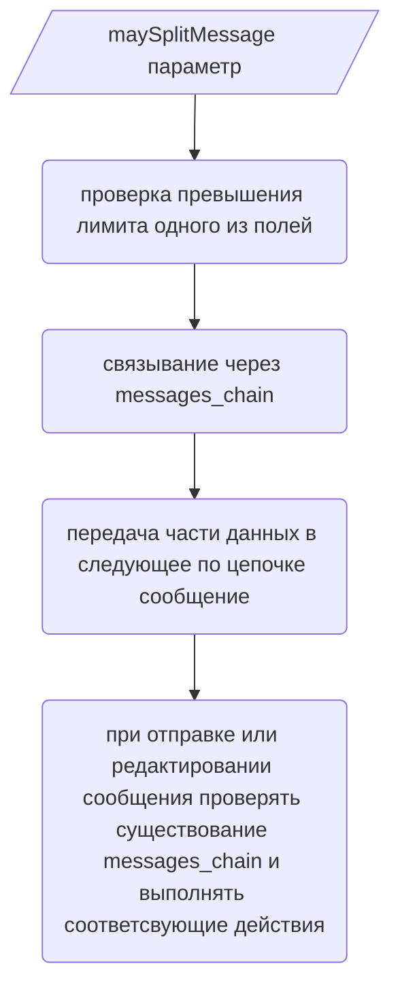

Система цепочек сообщений — это механизм, предназначенный для обхода ограничений платформ обмена сообщениями на размер одного сообщения. Она позволяет разделить одно логическое сообщение на несколько физических, связанных между собой.

### Какие данные и как передаются в следующее по цепочке сообщение?

| Данные              | Эффект                                                                                      |
| :------------------ | :------------------------------------------------------------------------------------------ |
| поле footer         | перемещается в последнее сообщение                                                          |
| компоненты          | перемещаются в последнее сообщение                                                          |
| реакции             | перемещаются в последнее сообщение                                                          |
| поле content        | разделяется по символу; сохраняет разметку блоков кода                                      |
| поле description    | разделяется по символу; сохраняет разметку блоков кода                                      |
| поле fields         | лимит на каждый элемент остается прежним, но количество сегментов становится неограничено   |
| обработчики событий | конечный разработчик: перехват и проверка связанности сообщений на уровне обработки событий |

### Поток

#### На стороне пользователя (применение)

(либо напрямую через justSendMessage, без шага createMessage)

#### На стороне реализации (внутренняя)

##### В момент создания

- [x] Проверить конфигурацию
- [x] Проверить привышения лимитов
- [x] Использовать move_partial_data_to_chain

##### В момент отправки

- [x] При редактировании целевого сообщения, если в полезной нагрузке присутсвует опция maySplitMessage, но отсутсвует поле \_chain_child, то попытаться найти существующую связанную цепочку и обновить полезную нагрузку с целью очистить содержимое от устаревших данных (задействованы move_partial_data_to_chain, \_rob_already_prepared);
- [x] Получить + обновить или создать экземпляр сообщения (child_message) + зареестрировать этот экземпляр в хранилище цепочек(chain_map);

##### diagnosticLimits

- [x] Входные данные полезная нагрузка и список ключей для диагностики
- [x] Выходные данные состояние isExceeding и набор «имя поля – превышение квоты»

##### move_partial_data_to_chain

- [x] Создает полезную нагрузку потомка
- [x] Входные данные оригинальная полезная нагрузка с доступом к мутированию, конфигурация разделения и результат диагностики
- [x] Перемещает поля вроде footer вниз и гарантирует, что сообщение не останется пустым (move_static_down)
- [x] К разным полям применяются отличные стратегии. Так на этом этапе контент дробится на меньшие части; вызвать сбой, если неделимая часть превышает конкретный лимит
- [x] Дать предсказание минимального количества сообщений способных вместить всё содержимое
- [x] Применить разделение «на два» на основе конфигурации балансировщика и других данных

##### \_rob_already_prepared

- [x] Решает прецендент когда целью становится сообщение в цепочке у которого есть потомки, и это выясняется только в момент отправки
- [x] Удаляет поля, передача которых в потомка обеспечивается предшествующим вызовом move_partial_data_to_chain

##### В момент удаления сообщения

- [x] При существовании в кэше-хранилище (chain_map), взять цепочку, найти все сообщения и инициализировать их удаление

> [!NOTE]
> Цепочка автоматически удаётся при получении сигнала об удалении одного из элементов цепи (ChainLifecycleOnMessageDelete)

##### Общие

- [x] Не добалвлять различные стратегии балансировки, потому что это не в приоритете
- [x] Решить пробему двойного ответа на взаимодействие, для этого все-таки потребуется метод определения канала
