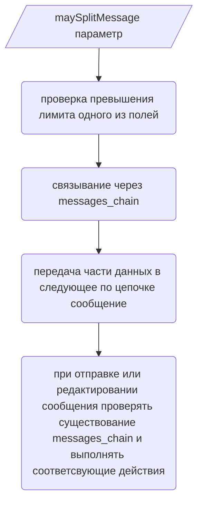
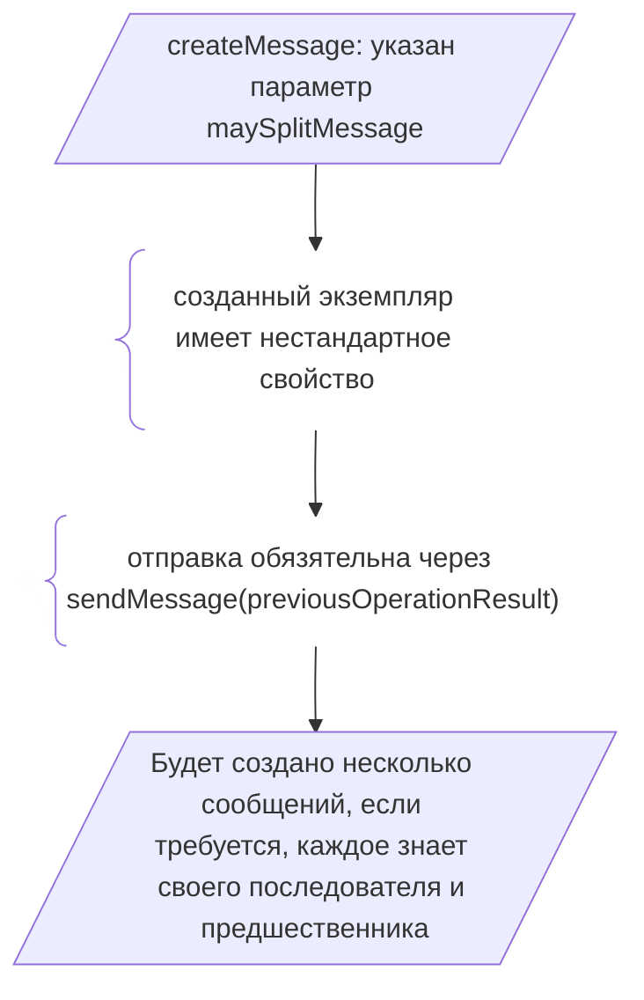

### Какие данные и как передаются в следующее по цепочке сообщение?

| Данные              | Эффект                                                                                      |
| :------------------ | :------------------------------------------------------------------------------------------ |
| поле footer         | перемещается в последнее сообщение                                                          |
| компоненты          | перемещаются в последнее сообщение                                                          |
| реакции             | перемещаются в последнее сообщение                                                          |
| поле content        | разделяется по символу; сохраняет разметку блоков кода                                      |
| поле description    | разделяется по символу; сохраняет разметку блоков кода                                      |
| поле fields         | лимит на каждый элемент остается прежним, но количество сегментов становится неограничено   |
| обработчики событий | конечный разработчик: перехват и проверка связанности сообщений на уровне обработки событий |

### Поток

#### На стороне пользователя (применение)

(либо напрямую через justSendMessage, без шага createMessage)

#### На стороне реализации (внутренняя)

- [ ] Создать сообщение с последователями
- [ ] Сохранить в карте

- [x] Выяснить почему main_embed_of возвращает EmbedBuilder
- [x] Прийти к вызову функции разделения
- [x] Отправить сообщения одно за другим если превышен лимит
- [x] Описать интерфейс payload
- [x] Отправить разделенное сообщение
  - [x] Разделить разделяемое по сепаратору
  - [x] Сделать прогноз по количесву сообщений в цепочке
  - [x] Внести блоки кода
  - [x] Отреагировать если после разделения одно из сообщений вновь превышает лимит
  - [x] Придумать учитывающий это балансировщик
  - [x] Обрабатывать изменения родителя
- [ ] Не добалвлять различные стратегии балансировки, потому что это не в приоритете
- [ ] Решить пробему двойного ответа на взаимодействие, для этого все-таки потребуется метод определения канала
